# 𝙷𝚎𝚕𝚕𝚘, 𝙸 𝚊𝚖 𝚂𝚞𝚗𝚛𝚊𝚢𝚕𝚊𝚒𝚗

<table width="100%">
<tr>

<td width="50%" valign="top">

**𝚂𝚃𝙰𝙲𝙺**

`C` · `C++` · `Python` · `Java`

 

**𝚃𝙴𝙲𝙷𝙽𝙾𝙻𝙾𝙶𝙸𝙴𝚂**

`CMake` · `Qt` · `FastAPI` · `Redis` · `Docker`

`Git` · `Bash` · `Linux` · `Debian`

 

**𝚃𝙾𝙾𝙻𝚂**

`Visual Studio` · `PyCharm` · `IntelliJ IDEA`

</td>

<td width="50%" valign="top">

**𝚂𝚃𝙰𝚃𝚂**

</td>

</tr>
</table>

 

**𝙿𝚁𝙾𝙹𝙴𝙲𝚃𝚂**

<table width="100%">
<tr>

<td width="50%" valign="top">

### `01`

**Video Summarizer**

A project focused on processing  
and working with video content.

`Python` · `FastAPI` · `Redis` · `Docker`

</td>

<td width="50%" valign="top">

### `02`

**Desktop Applications**

Experiments and applications focused  
on architecture, interfaces and system design.

`C++` · `Python` · `Java`

</td>

</tr>
</table>

 

**𝙰𝙲𝚃𝙸𝚅𝙸𝚃𝚈**

 

**𝙻𝙰𝙽𝙶𝚄𝙰𝙶𝙴𝚂**

