<table>
<tr>
<td valign="top" width="50%">

<blockquote>
  <h1>𝙷𝚎𝚕𝚕𝚘, 𝙸 𝚊𝚖 𝚂𝚞𝚗𝚛𝚊𝚢𝚕𝚊𝚒𝚗</h1>
  
Software Engineering student focused on desktop application development.

  

    <b>Languages</b> 
    <code>C</code> · <code>C++</code> · <code>Python</code> · <code>Java</code>
  

  

    <b>Tools</b> 
    <code>Git</code> · <code>Bash</code> · <code>Docker</code> · <code>Debian</code> 
    <code>Visual Studio</code> · <code>PyCharm</code> · <code>IntelliJ IDEA</code>
  

</blockquote>

</td>
<td valign="top" width="50%" style="padding-left: 10px;">

  

</td>
</tr>
</table>
